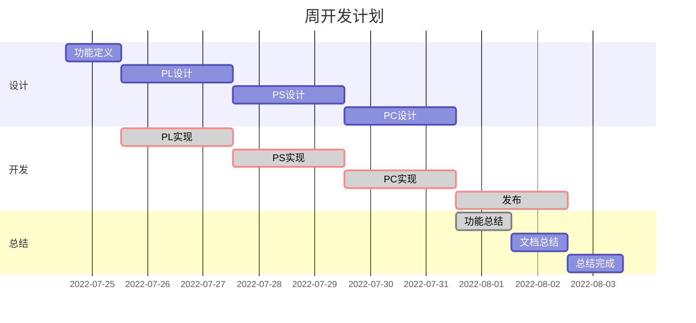

<!--
##################################################################################
## Company: fpgaPublish
## Engineer: f
## 
## Create Date: 2022/07/24 12:52:03
## Design Name: plan_time
## Module Name: 
## Project Name: 
## Target Devices: 
## Tool Versions: 
## Description: 
## 
## Dependencies: 
##  
## Revision: 
## Revision 0.01 - File Created 
## Additional Comments:
## 
##################################################################################
-->

## light_eye_design_plat2
### 2022/07/24 12:48:17
- [ ] PL实现
    * 实现BRAM的数据灰度处理并转发ARM
- [ ] PS实现
    * 实现UDP图像接收转存DDR
    * 实现BRAM数据收发
- [ ] PC实现
    * 实现UDP图像收发
    * 实现图像转存到file
    * 实现图像在控件显示
