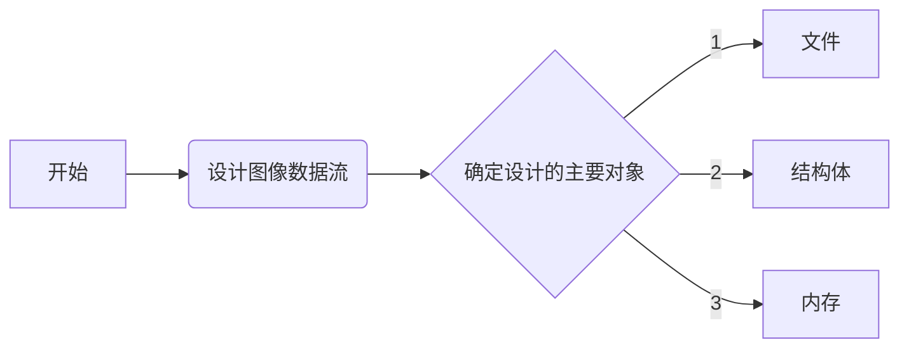
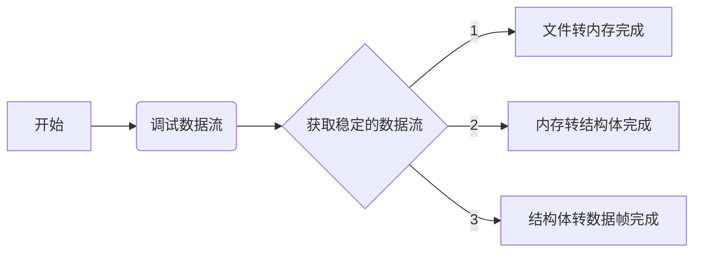

# QT图像开发

## QT设计思路
### 2022/07/24 16:28:37
    1. 实现UDP的数据传输
        * 目前这个部分基本完成
    2. 实现内存和结构体的交互
        * 交互方法确定，可以实现
    3. 实现文件和结构体的交互
        * 正在考虑如何将数据流转化为文件
        * 基本打通数据流，准备通过数据检查的方式完善程序

## 图像数据流
### 2022/07/25 22:29:25
    1. 目前结构体的转存基本完备，对称设计是解决问题的关键
        * 对于数据中需要转化为对应结构的地方，需要关注
        * 地址的读取没有限制，但是内存的申请存在严格的限制，所以需要设置合理的内存结构去实现数据的缓存
    2. 解决数据接收的问题
        * 主要针对内存操作采用数组的方式，降低了速度，后续有时间再优化
    3. 对于QT的内存访问机制需要观察
        * 第一阶段的任务基本完成
