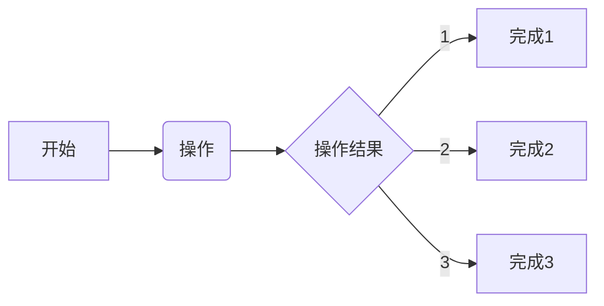

<!--
##################################################################################
## Company: fpgaPublish
## Engineer: f
## 
## Create Date: 2022/08/13 11:12:19
## Design Name: version
## Module Name: 
## Project Name: 
## Target Devices: 
## Tool Versions: 
## Description: 
## 
## Dependencies: 
##  
## Revision: 
## Revision 0.01 - File Created 
## Additional Comments:
## 
##################################################################################
-->

## 驱动日志
### 2022/08/13 11:12:24
    1. 修复多驱动的BUG，将其列入综合检查项
        * 
    2. 修复握手数据使用错误的BUG
        * 
    3. 修复写入使能信号使用错误的BUG
        * 反馈数据写入错误，检查发现地址未预留状态更新
