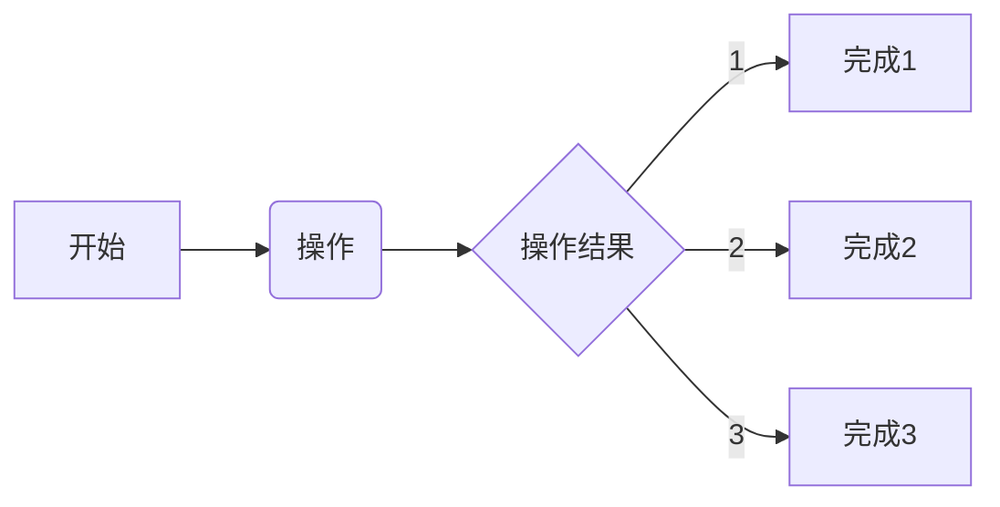

<!--
##################################################################################
## Company: fpgaPublish
## Engineer: f
## 
## Create Date: 2022/08/06 00:28:18
## Design Name: version
## Module Name: 
## Project Name: 
## Target Devices: 
## Tool Versions: 
## Description: 
## 
## Dependencies: 
##  
## Revision: 
## Revision 0.01 - File Created 
## Additional Comments:
## 
##################################################################################
-->

## 设计思路
### 2022/08/06 00:28:22
    1. 使用FPGA实现包括数据处理在内的所有的IP化设计
        * 
    2. 完成包括系统设计的所有的要素
        * 
    3. 整理设计的流程，将注释作为系统级的设计的最大的推动力
        * 完成一个基础版的硬件平台
