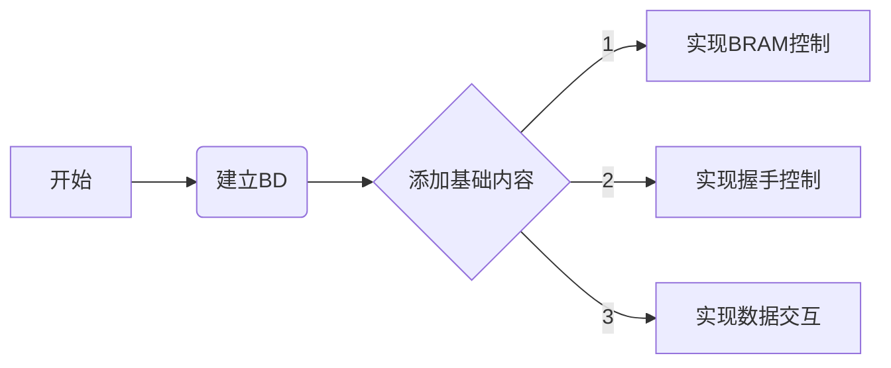

<!--
##################################################################################
## Company: fpgaPublish
## Engineer: f
## 
## Create Date: 2022/07/31 02:11:38
## Design Name: version
## Module Name: 
## Project Name: 
## Target Devices: 
## Tool Versions: 
## Description: 
## 
## Dependencies: 
##  
## Revision: 
## Revision 0.01 - File Created 
## Additional Comments:
## 
##################################################################################
-->

## ZYNQ设计原理
### 2022/07/31 02:11:49
    1. 利用BRAM实现图像的数据存储
        * 基于已有的BRAM总线编写读写模块
    2. 利用AXI实现握手控制
        * 基于SHK总线进行设计
        * 基于总线的存储阵列是可以实现的
        * 为了简化整个流程，需要使用脚本快速生成对应的存储阵列
    3. 完成整个框架的实现
        * 完成图像处理的基本流程
