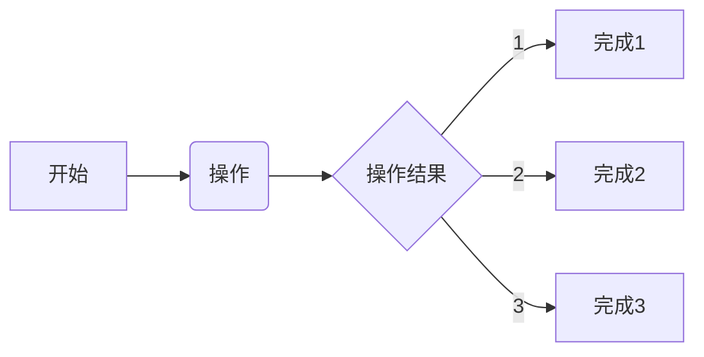

## IP封装的若干问题
### 2022/07/31 18:58:24
    1. 目前的IP自动识别存在问题
        * 
    2. 已有的I和O的标识方法需要去除
        * 
    3. 必须充分利用自动识别的特性
        * 尝试去掉I和O后进行解析

```mermaid
graph LR
A[开始] -->B(操作)
B --> C{操作结果}
C -->|1| D[完成1]
C -->|2| E[完成2]
C -->|3| F[完成3]
```