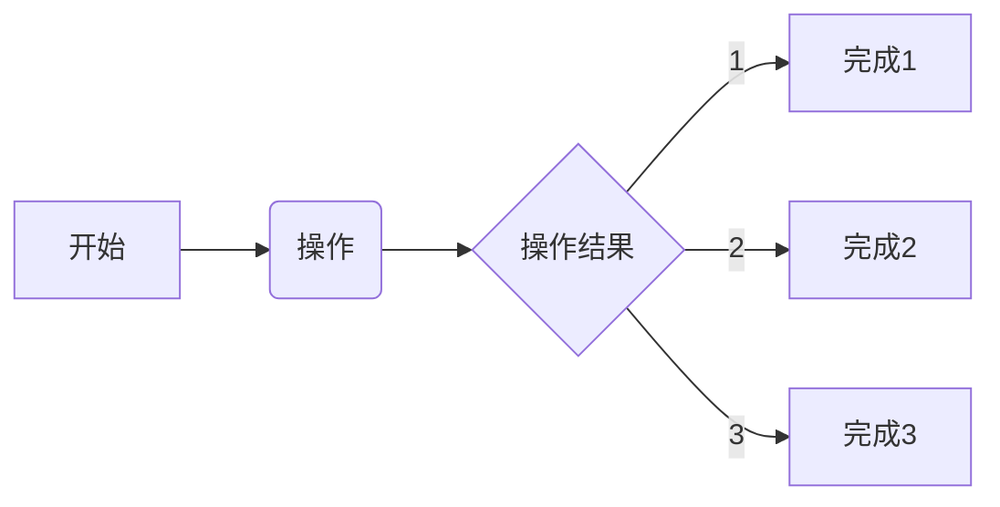

## 设计任务
### 2022/08/07 23:21:37
    1. 完成总线化设计
        * 
    2. 完成总线化仿真
        * 
    3. 完成IP的封装测试
        * 这里BRAM的数据总线被识别成了CLK和RST，进行处理一下，用脚本修正一下
        * 完成BRAM总线的自动添加，对于工程中IP和core，将两者分开以确保可以并行执行，同时在启动时自动添加IP脚本，core脚本复制对应的IP脚本

                                                                                                                                       

## All file version
### 22/08/07 23:51:53
### version of light_eye_v2_13:
* Number of version in level:
    * 0~9:1000000000
* file tower
v0.01--[gray_driv](D:/e1_library/f2_light_eye_plat2/light_eye_pl_work3/light_eye_v2_13.srcs/sources_1/new/gray_driv.v): File Created

## All file version
### 22/08/08 00:54:30
### version of light_eye_v2_13:
* Number of version in level:
    * 0~9:1000000000
* file tower
v0.01--[gray_driv](D:/e1_library/f2_light_eye_plat2/light_eye_pl_work3/light_eye_v2_13.srcs/sources_1/new/gray_driv.v): File Created

