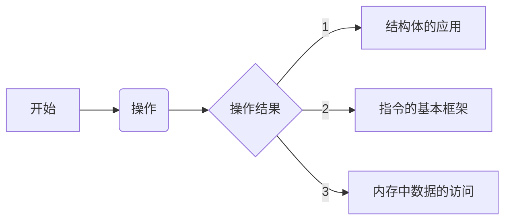
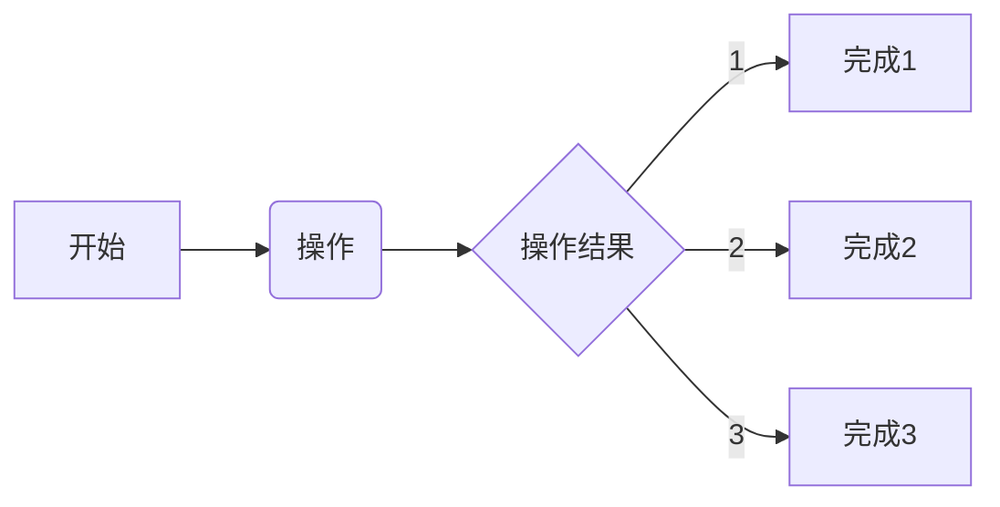

## 实现ARM端的指令解析
### 2022/07/28 22:02:16
    1. 实现ARM的指令的解析
        * 
    2. 进行指令响应
        * 
    3. 完成ARM端数据流的熟悉
        * 

## 添加指令解析功能
### 2022/07/30 18:27:46
    1. 目前的指令解析基本完成，暂时只使用一个结构体进行缓存
        * 后续可以基于指令对不同的指令进行不同的结构体缓存
    2. 
        * 
    3. 
        * 

