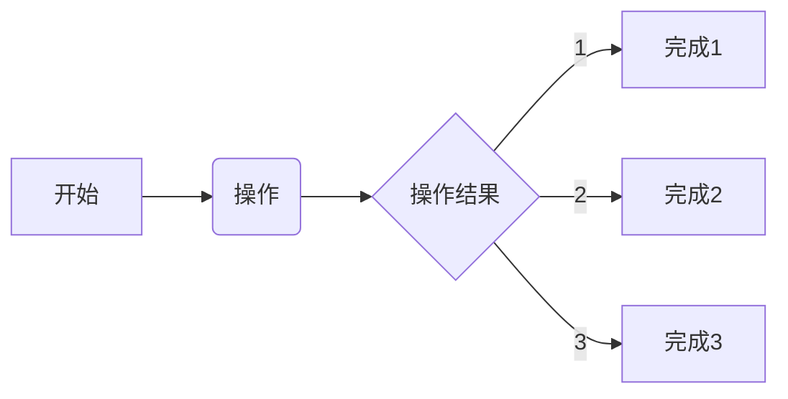

## 完善PS端数据传输
### 2022/08/14 16:58:26
    1. 完成BRAM数据的写入和读取
        * 使用FOR循环实现数据的32位读取
        * 该方式是稳定的，速度较慢，注意地址必须是4的整数倍
    2. 完成图像数据的转存
        * 完成网口数据到BRAM的转存，主要利用FPGA实现函数加速，同样使用控制及测试模块
        * 尝试添加AXI的控制总线，正在解析对应的文档
    3. 实现图像的灰度处理
        * 定位到硬件的BRAM写入存在问题
        * 需要重新更新硬件
        * 这个需要一定的时间
