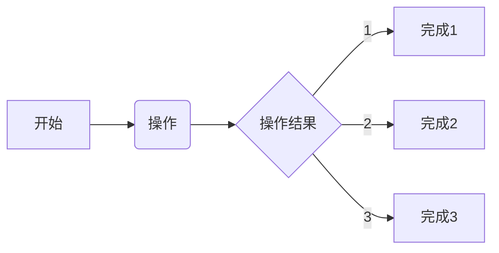

## 完成基本目标
### 2022/08/23 22:52:31
    1. PC能收发数据
        * 
    2. PS能收发数据和解析指令
        * 
    3. PL能进行握手总线的响应
        * 

```mermaid
graph LR
A[开始] -->B(操作)
B --> C{操作结果}
C -->|1| D[完成1]
C -->|2| E[完成2]
C -->|3| F[完成3]
```