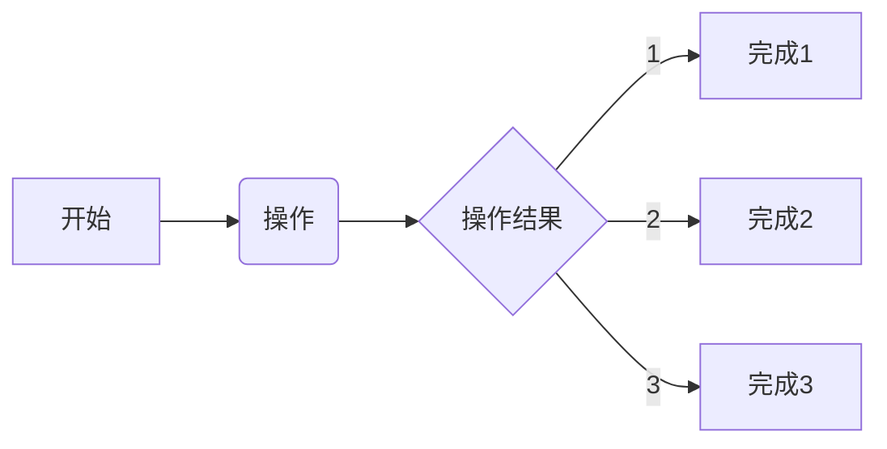

## 实现的优势所在
### 2022/11/12 00:05:04
    1. FPGA的并行系统为小单元的并行做好了准备
        * 无论神经元还是其他的算法，小单元算法依旧是整个设计的基石
        * 小单元实际上就是对复杂任务的具体的分解
        * 实现的效果将满足大量的复杂要求
        * 换言之，眼睛就是识别算法的最高样品
    2. FPGA的算力针对复杂场景具备无限的优势
        * 算力是保证整个设计的基础
        * 高速地处理流才能确保数据可行
    3. FPGA可以实现整个数据的高速链路
        * 高速链路可以在少量的内存中实现大量的高端算法
        * 数字所及，皆为所至

## 边沿检测算法的实现
### 2022/11/13 22:56:59
    1. 图像识别的入门，也是后续算法简化的关键
        * 以这个算法为起点，进行后续的优化
    2. 完成图像滤波后，可以训练硬件算法
        * 
    3. 数据传输的设计也要同步搞起来
        * 整个系统将成为一个综合的处理系统
        * 目前的设计体系，训练量还是不足
        * 尽快建立训练学习一起进行的体系
        * 为了数字的荣耀，前进
