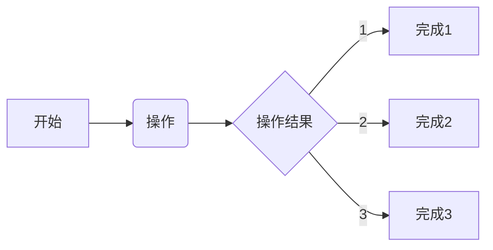

## PC图像识别设计
### 2022/11/16 22:55:40
    1. 设计界面
        * 基于之前的模型快速完成界面的设计
    2. 设计参数
        * 添加常用的参数设置
        * 开始建设参数页
    3. 设计信息
        * 
    4. 设计功能
        * 

## 添加图片加载功能
### 2022/12/09 23:31:59
    1. 上位机添加图片的显示和加载功能
        * 
    2. 指定设计的协议内容
        * 
    3. 需要实现数据流程测试
        * 
