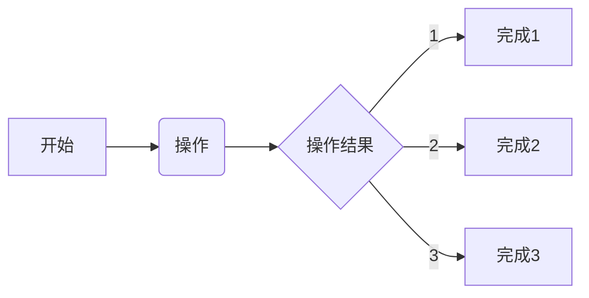

## PC图像识别设计
### 2022/11/16 22:55:40
    1. 设计界面
        * 基于之前的模型快速完成界面的设计
    2. 设计参数
        * 添加常用的参数设置
        * 开始建设参数页
    3. 设计信息
        * 
    4. 设计功能
        * 

```mermaid
graph LR
A[开始] -->B(操作)
B --> C{操作结果}
C -->|1| D[完成1]
C -->|2| E[完成2]
C -->|3| F[完成3]
```